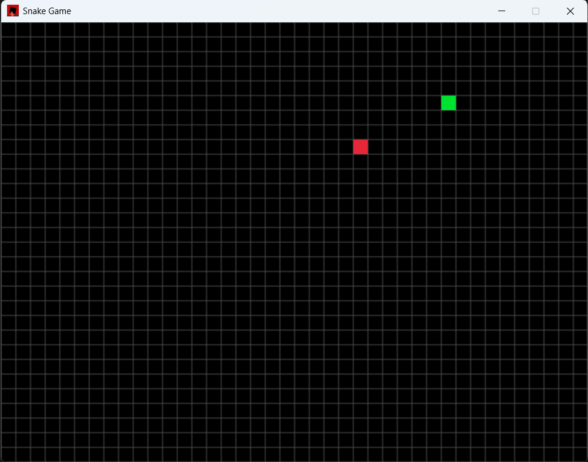

# Snake Game (macroquad + Rust)

Small grid-based snake game implemented with `macroquad`.



Features
- **Wrap-around:** snake wraps when crossing grid edges.
- **Food:** red food spawns randomly (never on the snake).
- **Growth:** snake grows when eating food.
- **No reverse:** directional input cannot reverse directly into the snake's body.
- **Game over:** colliding with self shows a Game Over message; press `R` to restart.

Build & Run (development)

PowerShell (Windows):
```powershell
cargo run
```

Release build (Windows executable)
```powershell
cargo build --release
# The built exe will be at:
# target\release\snake_game.exe
```

Building for Windows targets

If you want to build the native Windows binary from another platform or target a specific Windows toolchain, add the Rust target first (run once):

Windows GNU target:

```powershell
rustup target add x86_64-pc-windows-gnu
cargo build --release --target x86_64-pc-windows-gnu
# Binary: target\x86_64-pc-windows-gnu\release\snake_game.exe
```

Windows MSVC target:

```powershell
rustup target add x86_64-pc-windows-msvc
cargo build --release --target x86_64-pc-windows-msvc
# Binary: target\x86_64-pc-windows-msvc\release\snake_game.exe
```

Note: Building the MSVC target on non-Windows hosts requires an appropriate cross-compilation toolchain; for cross-building from Linux/macOS it's often easier to build on Windows or use CI.

Releases / Download button for Windows
- You can publish a GitHub Release and attach the built `snake_game.exe` (or a ZIP that contains it).
- Once uploaded, the asset is downloadable via a predictable URL:

`https://github.com/HirenTumbadiya/snake_game/releases/latest/download/<ASSET_NAME>`

<!-- [](https://github.com/HirenTumbadiya/snake_game/releases/latest/download/snake_game.exe) -->
